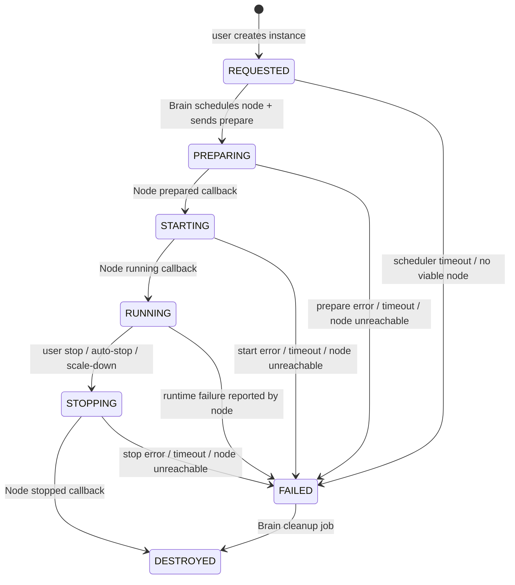

# Instance Lifecycle & State Machine

## Purpose

Define the **authoritative lifecycle** for a game server instance, including states, transitions, triggers, and failure handling. This document is the shared reference for the Brain scheduler and Node Agent behavior, and it should be used as the baseline for lifecycle tests (see #24).

## State Machine Diagram

## States

- **REQUESTED**: Instance exists in the system but has not been assigned to a node.
- **PREPARING**: Node is preparing the instance (pulling images, merging templates, allocating volumes).
- **STARTING**: Node is starting the container and waiting for health/ready signals.
- **RUNNING**: Instance is active and accepting connections.
- **STOPPING**: Instance is being stopped (user request, auto-stop, or scheduler decision).
- **DESTROYED**: Instance resources are fully cleaned up and final.
- **FAILED**: Instance encountered an unrecoverable error before reaching a stable state.

## Allowed Transitions & Triggers

| From | To | Trigger | Owner | Notes |
| --- | --- | --- | --- | --- |
| REQUESTED | PREPARING | Brain scheduler assigns a node and sends **prepare** | Brain | Node must acknowledge via callback.
| REQUESTED | FAILED | Scheduler timeout or no viable node | Brain | Failure reason recorded and visible to user.
| PREPARING | STARTING | Node reports **prepared** | Node | Template merge and image pull succeeded.
| PREPARING | FAILED | Node prepare error / timeout / node unreachable | Brain or Node | Brain marks failure on timeout or explicit error callback.
| STARTING | RUNNING | Node reports **running** | Node | Health check or ready signal reached.
| STARTING | FAILED | Node start error / timeout / node unreachable | Brain or Node | Brain marks failure on timeout or explicit error callback.
| RUNNING | STOPPING | User stop, auto-stop, or scheduler scale-down | Brain | Stop intent is recorded before dispatch.
| RUNNING | FAILED | Node runtime failure callback | Node | Covers crash loops or container exit.
| STOPPING | DESTROYED | Node reports **stopped/destroyed** | Node | Final cleanup complete.
| STOPPING | FAILED | Node stop error / timeout / node unreachable | Brain or Node | Brain marks failure on timeout or explicit error callback.
| FAILED | DESTROYED | Cleanup job | Brain | Ensures resources are reclaimed and state is terminal.

## Failure Handling Rules

- **Timeouts**: Brain transitions to **FAILED** if expected callbacks are not received within configured timeouts.
- **Node Unreachable**: Treat as failure for any in-flight action (PREPARING, STARTING, STOPPING).
- **Explicit Errors**: Node callbacks with error details transition to **FAILED** immediately.
- **Cleanup**: FAILED instances are eligible for background cleanup that transitions them to **DESTROYED**.
- **Idempotency**: Brain should reject transitions that are not allowed from the current state to prevent illegal updates.

## Notes for Implementations & Tests

- The state machine above is the **source of truth** for lifecycle tests (see #24).
- Every transition must emit a corresponding instance event with the previous and next state.
- Any new state or transition must update this document before code changes are merged.

## Related Docs

- `docs/INSTANCE-LIFECYCLE.md` (legacy overview)
- `docs/NODE-FLOW.md`
- `docs/brain-specs.md`
